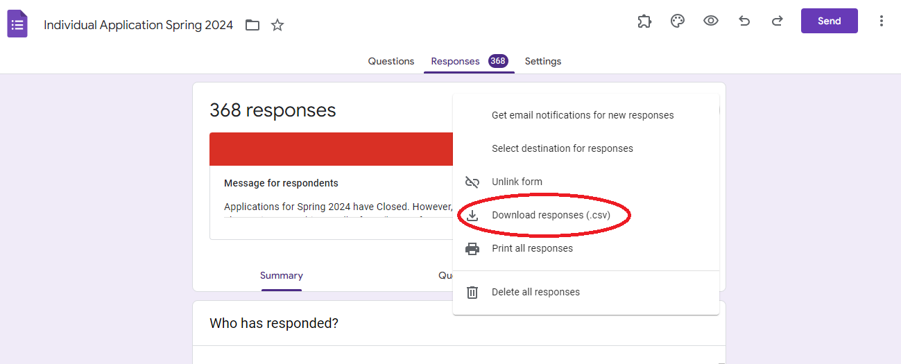

# VSVS_Scheduler

[**Authors**](docs/authors.txt) 

**Description**: Imports data from data/classrooms.csv, data/individuals.csv, and data/partners.csv and assigns
 volunteers to groups. 

## Input File Prep
You will need the applications from volunteers, partners, and teachers. 
Currently we use Google Forms for this. 
\
Export the responses as csv files.



You will want to create a folder called `data/` inside this repo and add all the csv files into the folder. It should look like so:
```
- data/ (input csv files)
    - classrooms.csv
    - individuals.csv
    - partners.csv
```
---
***Note:*** \
It's not strictly necessary that this folder be called data.
However, if you choose to call your folder or the files something different you will need to update the following variables inside of [globals.py](vsvs_scheduler/globals.py):\
`CLASSROOM_RAW_DATA_FILE` 
\
`VOLUNTEER_RAW_DATA_FILE`
\
`PARTNER_RAW_DATA_FILE`

If you choose to name the folder something other than data then you will
also have to edit the .gitignore file and add the name you choose for the folder followed by a "/". 
This will ensure that the files inside the folder are not uploaded to GitHub and are ignored. 

**This is important because the applications contain personal information about the people we work with!**  

----

Before running the script, double check that all the column names in the csv files match the column in [globals.py](vsvs_scheduler/globals.py)

Now you're ready to run the script!
The program can be run through the main method in
 [vsvs_scheduler/main.py](vsvs_scheduler/main.py) 
 Assuming successful operations, there will be one output file generated: `results/assignments.csv` which will contain team assignments. 

 
## Repository Structure

This repository has/will have the following files:
```
- docs/
    - images/ (directory with images for readme)
    - source/ (project documentation using sphinx)
    - authors.txt (list of contributors)
    - requirements.txt (requirements for virtual environment)
    - OnboardingIT.md (onboarding docs for new IT members)
- tests/
    - conftest.py (contains fake data for test)
    - test_data_uploader.py (tests data_uploader)
- vsvs_scheduler/
    - classroom.py (Classroom class)
    - data_uploader.py (DataUploader class collects input from files)
    - globals.py (list of constants)
    - main.py (calls on Scheduler & outputs files)
    - partners.py (Partners class)
    - scheduler.py (Scheduler class assigns volunteers, partners, board to classrooms)
    - schedule.py (Schedulre class parses raw schedule input from volunteers)
    - teacher.py (Teacher class)
    - volunteer.py (Volunteer class) 
```
 
 
## Sorting Algorithm

TODO:

## To-do
 
### For Fall 2020:

### Testing Metrics:
- [ ] people can make classrooms they're assigned to
- [ ] groups are assigned together
- [ ] see how many groups of <MAX there are

### For the Future:

- [ ] sort robotics?
- [ ] optimize scheduling more by adding TRAVEL_TIME constants for every school
- [ ] do something if classroom is more than hour long
- [ ] make a teacher sign up form with better data input and data validation
- [ ] add a lot of unit tests

### Possible To-do:
- [ ] The phone numbers have different formats. We could use this [package](https://pypi.org/project/phonenumbers/) to parse phone numbers.
- [ ] Add type annotations/docstrings to specify the type for each attribute
 
 
